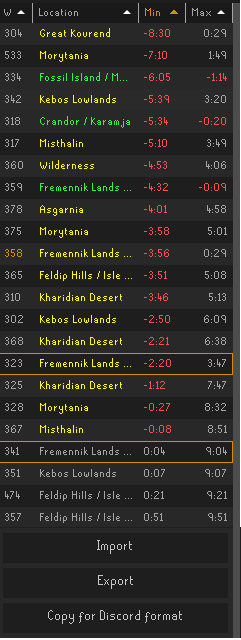

# Shooting Star Tracking
- Track the location and time for shooting stars on each world.
- Can sort by world, location, min time, or max time to landing.
- Export the stars you have found to your clipboard and share with other people.
- Import other's exported data by copying it to your clipboard and clicking 'Import'
- Remove clipboard worlds button checks your clipboard for all occurences of wxxx, 
e.g. w315 and removes them from your tracking list.
- Double click a row or right click "Hop to" to hop to the world a star is on
- Right click "Remove" on a row to remove the star
- Right click "Add Notification" to get a notification for when the star lands.
- Right click "Remove Notification" to remove a notification.
- An orange border means a star is marked for notification.
- Notify percentage config gives you control of when in the range of min to max time to notify you. E.g. 50% would be half way between the min and max time.
- The world in orange is the world you are currently on
- Location colors
  - Green: Definitely Landed
  - Yellow: Possibly landed
  - Grey: Not landed

